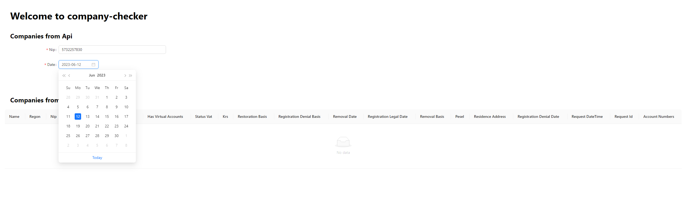
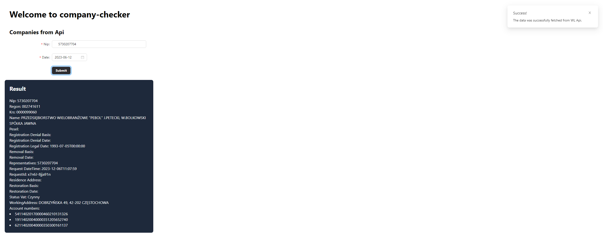
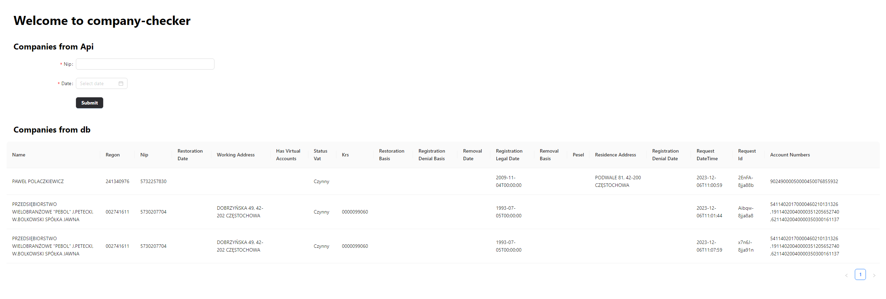
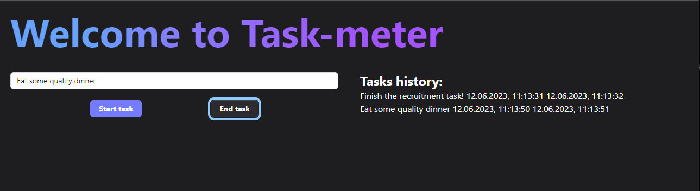

# Recruitment task

In this repo you can find finished recruitment tasks.

## Task 1

Write an application in C# that will allow you to search for information about entrepreneurs after the tax identification number. Once downloaded, the information should be displayed on the website and saved to the database. Use the WL Register API (mf.gov.pl). \* An additional advantage will be the use of React.js in the front-end.

Chosen tech-stack:

-   .Net Core 7.0 - backend,
-   MsSQL - database,
-   React + TypeScript - frontend library,
-   Vite - frontend tooling,
-   TailwindCss - css framework,
-   AntDesign - UI library,
-   Axios - http client.

Backend offers us two endpoints:

-   GET /api/v1/company/{nip} - here we can get company from WL API. Due to the WL requirements, we also need to provide date (query).
-   GET /api/v1/company/saved-requests - here we can get all of the saved requests.

Backend solution is divided into three projects:

-   API - here we can find our app controllers, this is also the main project of the solution.
-   Core - here we can find logic of our application (Services, Enums, Utils).
-   Data - this layer is responsible for data operations (Entities, Migrations, Repositories, DataBaseContext).

### App screenshots

Getting company data form:

Getting company data result:

Saved requests:

## Task 2

Write a simple application in React.js that allows you to measure time performed tasks. The application must allow you to start, apply name and completion of the task (start-stop system). Completed tasks let them be displayed in a list that will show the names of the tasks and their time duration. No application communication with the server is required, it can work only on RAM.

Chosen tech-stack:

-   React + TypeScript - frontend library,
-   Vite - frontend tooling,
-   TailwindCss - css framework,
-   AntDesign - UI library,

